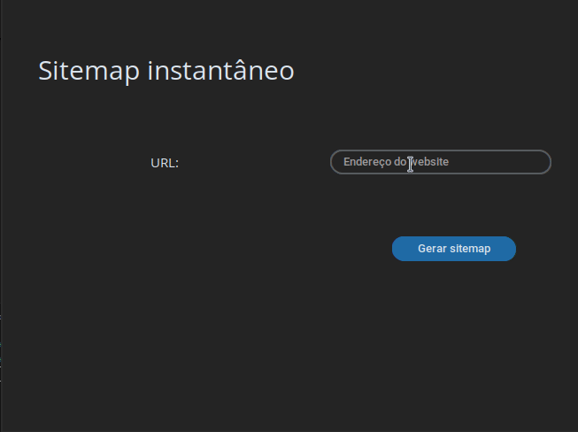
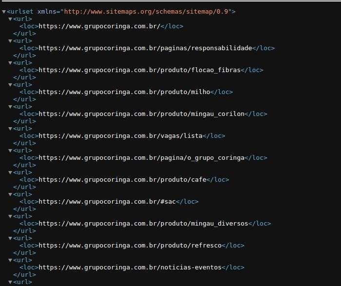

# Sitemap instantâneo






## 📖 Descrição

Esse projeto se refere a uma ferramenta capaz de gerar arquivos sitemap gratuitamente para qualquer site. 

Sitemap é um arquivo que fornece informações sobre páginas e outros arquivos de um site, indicando a relação entre eles. O Google utiliza o sitemap para rastrear um site com mais eficiência.

Como utilizar?

- Digite a URL (endereço do website) na caixa de texto;
- Clique em gerar sitemap;
- Você será solicitado a escolher um nome de arquivo e pasta para salvar o sitemap;
  

## 🛠️ Funcionalidades

- Geração de arquivo sitemap de forma fácil e intuitiva


## 📡 Tecnologias utilizadas

<div align="center"> 

</div>
<br/><br/>

## ⏳ Inicialização

Esse projeto foi desenvolvido usando diversas tecnologias. 
Para o frontend, foi utilizada a biblioteca CustomTkinter para a construção de uma interface desktop moderna. 

Para o backend, foram usadas as bibliotecas BeautifulSoup, requests, validators e xml.etree.ElementTree.

Para executar o projeto nas plataformas Windows ou Linux, você pode baixar as releases com o software portável. Além disso, você pode baixar as releases instaláveis. 

Alternativamente, se você for um desenvolvedor e deseja testar o projeto em um ambiente de desenvolvimento, siga os passos a seguir:

1. Crie um ambiente virtual e instale as dependências

```shell
python -m venv sitemap_instantaneo
```

```shell
pip install -r requirements.txt
```

2. Execute o app

```shell
python app.py
```

<br/>

## 🤵🤵‍♀️ Colaboradores

O único colaborador desse projeto sou eu (Eduardo Vitor).

<br/>

## 🔎 Status do Projeto


<br/>

## 📑 Referências
[CustomTkinter](https://github.com/TomSchimansky/CustomTkinter)

[Beautiful Soup](https://beautiful-soup-4.readthedocs.io/en/latest/)

[requests](https://pypi.org/project/requests/)

[validators](https://pypi.org/project/requests/)

[xml.etree.ElementTree](https://docs.python.org/3/library/xml.etree.elementtree.html)
